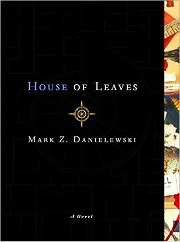

# House-of-Leaves-Chrome-Extension
This chrome extension aims to extend a sense of verisimilitude to the book House of Leaves by bringing a feature of the book, the word "house" occurring in  blue, off the page and into our digital lives.
 

# My Motivation
When the extension is enabled, all occurences of the word house on any webpage will be blue.
 
The aim is to catch people off guard and bring back the sense of being encompassed by the book's reality.
 
The technical focus of this project is to do DOM manipulation and traversal without the use of a library like jQuery.

# Author's Motivation
[Here](https://www.reddit.com/r/houseofleaves/comments/3lqfro/why_is_house_in_blue_see_comment_pls/) is a Reddit post speculating on the motivation behind why the book was stylized this way.

